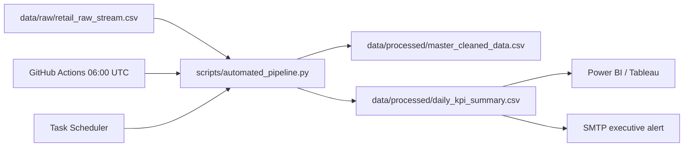

# Apexplanet Retail Analytics Capstone

[](https://www.python.org/)
[](scripts/automated_pipeline.py)
[](.github/workflows/daily_analytics_pipeline.yml)
[](#)

## Overview
Task 5 packages the Apexplanet Software Pvt. Ltd. internship capstone into a repeatable retail analytics operating loop. A raw order stream is validated, cleaned, scored for churn risk, aggregated into daily KPIs, published as tracked artifacts, and summarized for executive action.

The repository is designed for two operating modes:

- **Local:** Windows Task Scheduler runs the batch wrapper inside `.venv`.
- **Cloud:** GitHub Actions runs the same pipeline daily at 06:00 UTC and commits refreshed artifacts.

## Architecture



## Tech stack
Python 3.11, pandas, NumPy, scikit-learn, SciPy, joblib, python-pptx, SMTP, GitHub Actions, Windows Task Scheduler, Power BI-ready CSV semantic model, Markdown, and Jupyter.

## Directory tree

```text
.github/
	workflows/daily_analytics_pipeline.yml
README.md
requirements.txt
data/
	raw/retail_raw_stream.csv
	processed/master_cleaned_data.csv
	processed/daily_kpi_summary.csv
notebooks/
	01_data_cleaning_and_sql.ipynb
	02_exploratory_data_analysis.ipynb
	03_modeling_and_segmentation.ipynb
scripts/
	automated_pipeline.py
	generate_presentation.py
	schedule_runner.bat
reports/
	Executive_Summary_Report.md
presentation/
	presentation_slides.md
	presentation_slides.pptx
dashboards/
	live_links.txt
```

## Key findings and decision frame
- Revenue, profit margin, AOV, active customers, and high-risk customers are refreshed at daily grain.
- Churn risk is explainable and prioritizes recency, frequency, monetary value, and historical churn.
- Revenue growth should be evaluated with margin, discount, shipping, and customer concentration together.
- “ARIMA 92% accuracy” is a validation target to reproduce on an approved holdout, not an invented pipeline output.

## Current sample snapshot

The checked-in sample refresh contains 8 cleaned transactions from 1-4 September 2026.

| Measure | Current sample |
|---|---:|
| Revenue | INR 2,750.13 |
| Net profit | INR 594.00 |
| Profit margin | 21.60% |
| Orders | 8 |
| Active customers | 6 |
| High-risk customers | 2 |

These figures are illustrative and will be replaced when a new raw batch is processed.

## Data contract and outputs

### Required input columns

`Order_Date`, `Customer_ID`, `Category`, `Region`, `Units_Sold`, `Unit_Price`, `Discount_Pct`, `Shipping_Cost`, `Total_Revenue`, `Net_Profit`, and `Churn`.

### Cleaning rules

- Fail fast when required columns are missing.
- Remove exact duplicate records.
- Parse `Order_Date` as UTC and normalize to daily grain.
- Trim and standardize customer IDs, categories, and regions.
- Coerce numeric fields and remove rows missing core dimensions or financial measures.
- Bound discounts to 0-100, and quantities, prices, revenue, and shipping cost to non-negative values.

### Published artifacts

- `master_cleaned_data.csv`: cleaned transaction rows plus `Profit_Margin_Pct` and `Churn_Risk_Score`.
- `daily_kpi_summary.csv`: daily revenue, profit, margin, AOV, active customers, orders, units, high-risk customers, and rolling revenue/profit measures.

## Run locally

```powershell
py -3.11 -m venv .venv
.venv\Scripts\Activate.ps1
python -m pip install -r requirements.txt
python scripts\automated_pipeline.py
```

The pipeline writes both processed files to `data/processed/` and exits with status code 1 if ingestion, validation, or output generation fails.

Optional notification:

```powershell
$env:SMTP_HOST = "smtp.example.com"
$env:SMTP_PORT = "587"
$env:SMTP_USERNAME = "analytics@example.com"
$env:SMTP_PASSWORD = "<use-a-secret-store>"
$env:EXECUTIVE_EMAIL_TO = "executives@example.com"
python scripts\automated_pipeline.py --notify
```

## Automation
- GitHub Actions runs at 06:00 UTC and commits changed processed artifacts.
- Add `SMTP_HOST`, `SMTP_PORT`, `SMTP_USERNAME`, `SMTP_PASSWORD`, `EXECUTIVE_EMAIL_TO`, and optional `EXECUTIVE_EMAIL_FROM` as repository secrets.
- Windows Task Scheduler should invoke `scripts\schedule_runner.bat` daily after the virtual environment is created.

### GitHub Actions setup

1. Push the repository to GitHub.
2. Add the SMTP values under **Settings > Secrets and variables > Actions**.
3. Enable Actions and run `Daily Retail Analytics Pipeline` manually once with `workflow_dispatch`.
4. Confirm that the two files under `data/processed/` are refreshed by the bot commit.

The scheduled workflow uses Python 3.11, installs `requirements.txt`, runs with `--notify`, and commits only changed processed artifacts. SMTP notification is skipped with a warning when secrets are absent.

### Windows Task Scheduler setup

1. Create the environment and install dependencies using the local setup commands above.
2. Create a daily Task Scheduler task with program:
	`C:\path\to\task 5\scripts\schedule_runner.bat`
3. Set **Start in** to the repository root and run with a service account that can write to `data/processed/`.
4. Review the generated file under `logs/` after the first run.

## Dashboard links
- Power BI Service: [insert approved URL](dashboards/live_links.txt)

## Reporting and presentation

- [Executive summary report](reports/Executive_Summary_Report.md): ten-page source content covering architecture, insights, statistics, ML, dashboard design, recommendations, and limitations.
- [PowerPoint deck](presentation/presentation_slides.pptx): generated ten-slide executive presentation.
- [Slide outline](presentation/presentation_slides.md): editable slide-by-slide source.

The Power BI `.pbix`, exported PDF, screenshots, and cloud URL require the approved tenant and publication workflow, so their repository locations are documented as placeholders until those assets are supplied.

## Validation and maintenance

Run the following checks before submission or release:

```powershell
.venv\Scripts\python.exe -m py_compile scripts\automated_pipeline.py scripts\generate_presentation.py
.venv\Scripts\python.exe scripts\automated_pipeline.py
.venv\Scripts\python.exe -c "import json; from pathlib import Path; [json.loads(p.read_text(encoding='utf-8')) for p in Path('notebooks').glob('*.ipynb')]; print('notebooks valid')"
.venv\Scripts\python.exe -c "from pptx import Presentation; print(len(Presentation('presentation/presentation_slides.pptx').slides), 'slides')"
```

For a production rollout, add unit tests for schema validation, null handling, deduplication, score boundaries, and KPI totals, plus a time-based model validation test for any future classifier or forecast.

## Security and governance

- Never commit SMTP passwords, API keys, customer exports, or `.env` files.
- Use GitHub encrypted secrets or the Windows credential store for notification credentials.
- Treat `Churn_Risk_Score` as a prioritization signal, not an automated customer decision.
- Validate model claims on an approved holdout and record the data snapshot, feature definitions, and threshold used.
- Replace CSV persistence with governed warehouse tables when volume, access control, or audit requirements increase.

## Troubleshooting

- **Missing required columns:** compare the raw batch header with the data contract above.
- **No email received:** verify all `SMTP_*` and `EXECUTIVE_EMAIL_*` variables, SMTP port, TLS support, and recipient policy.
- **Scheduled job fails:** inspect `logs/`, confirm the task account has repository write access, and confirm the virtual environment exists.
- **Dashboard is stale:** rerun the pipeline, check the processed file timestamps, then refresh the BI dataset.

## Submission post

> Completed my Apexplanet Software Pvt. Ltd. analytics capstone across five tasks, progressing from data cleaning and exploratory analysis to SQL, visualization, modeling, and final reporting. The final solution deploys an automated retail pipeline that refreshes revenue, profit margin, AOV, active customers, and explainable churn-risk KPIs, with GitHub Actions, Windows scheduling, executive email alerts, a Power BI-ready model, a ten-page report, and a ten-slide presentation. Portfolio: `<repository-url>` | Dashboard: `<cloud-dashboard-url>`. #DataAnalytics #Python #PowerBI #MachineLearning #Apexplanet
