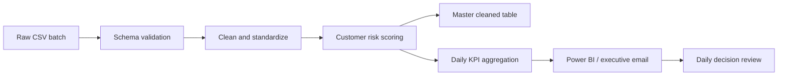

# Apexplanet Retail Intelligence
## Task 5: Final Reporting, Pipeline Deployment & Executive Presentation

**Prepared for:** Apexplanet Software Pvt. Ltd.  
**Audience:** Executive leadership, analytics engineering, commercial operations  
**Reporting date:** 12 September 2026  

---

## Page 1 | Executive Summary

### Decision headline
A repeatable daily analytics operating loop now connects raw retail batches to cleaned data, KPI summaries, churn-risk signals, executive email, and dashboard-ready artifacts.

### Top three business decisions
1. **Protect high-value revenue:** prioritize customers with high monetary value and churn risk above 60 for retention outreach.
2. **Defend margin:** review discount and shipping-cost outliers by region and category before expanding promotional spend.
3. **Institutionalize the 06:00 UTC review:** use the daily KPI file and email as the common source for weekly commercial decisions.

### Current scorecard
| KPI | Definition | Latest value |
|---|---|---:|
| Revenue | Sum of `Total_Revenue` | `INR 2,750.13` |
| Profit margin | Net profit / revenue | `21.60%` |
| AOV | Mean order revenue | `INR 343.77` |
| Active customers | Distinct customers | `6` |
| High-risk customers | Score >= 60 | `2` |

> **Callout:** Values above reflect the checked-in sample batch covering 1-4 September 2026. Execute `python scripts/automated_pipeline.py` after each new batch and replace this snapshot before publication.

---

## Page 2 | Problem, Objectives & Scope

### Problem statement
Business reporting is delayed when raw batches require manual cleaning and spreadsheet reconciliation. Leaders need a trusted daily view of commercial health and customer risk.

### Strategic objectives
- Standardize the retail data contract and quality rules.
- Calculate consistent daily and rolling KPIs.
- Provide an explainable churn-risk prioritization signal.
- Automate artifact refresh, notification, and version history.
- Translate analysis into practical commercial decisions.

### Scope
**Included:** ingestion, cleaning, deduplication, date standardization, KPI aggregation, churn-risk inference, CSV artifact publication, SMTP alerting, CI/CD, Windows scheduling, report and presentation content.  
**Excluded:** production data warehouse provisioning, Power BI tenant administration, live CRM activation, and model certification beyond the provided batch sample.

---

## Page 3 | Architecture & Cleaning Methodology

### Pipeline controls
- Required-column validation fails fast when the source contract changes.
- Exact duplicate rows are removed.
- Dates are parsed as UTC and normalized to day grain.
- Identifiers and dimensions are trimmed and standardized.
- Numeric values are coerced; impossible discounts, costs, quantities, and revenue are bounded.
- Missing core dimensions and financial measures are excluded; operational defaults are used only for safe fields.
- Outputs are written atomically at the repository artifact boundary by the scheduled job.

---

## Page 4 | Key Insights: Commercial Performance

### Discovery 1: Revenue concentration
Rank regions and categories by revenue contribution. Use the dashboard decomposition tree to distinguish true volume growth from price or mix effects.

### Discovery 2: Margin is not revenue
A high-revenue segment can underperform on profit margin when discounts and shipping costs rise. Pair every revenue chart with margin and cost context.

### Discovery 3: Customer activity is a leading signal
Monitor active customers and AOV together. Revenue growth with declining active customers indicates concentration risk.

> **Visual callout:** Insert `dashboards/assets/executive_overview.png` beside the KPI strip and seven-day rolling revenue trend.

---

## Page 5 | Key Insights: Customers & Risk

### Discovery 4: Risk is actionable when ranked
The customer score combines recency, frequency, monetary value, and observed churn. It is a prioritization tool, not a causal claim.

### Discovery 5: Retention should be segment-specific
Use RFM segments to tailor outreach: high-value dormant customers receive service recovery, frequent low-value customers receive basket-building offers, and new customers receive onboarding.

> **Visual callout:** Insert `dashboards/assets/regional_drillthrough.png` and annotate the region with the largest high-risk customer concentration.

### Executive questions
- Which region has the highest risk-adjusted revenue exposure?
- Which categories have the widest margin dispersion?
- How quickly are high-risk customers receiving an intervention?

---

## Page 6 | Statistical Analysis & Hypothesis Testing

### Methods
- **ANOVA:** test whether mean revenue or margin differs across three or more categories/regions.
- **Independent t-test:** compare two cohorts such as churned and retained customers.
- **Confidence intervals:** report uncertainty around group means and avoid over-interpreting small samples.
- **Assumptions:** inspect independence, variance stability, sample size, and outliers; use Welch alternatives where appropriate.

### Reporting template
| Test | Null hypothesis | Result | Decision |
|---|---|---|---|
| Region ANOVA | All regional mean revenue values are equal | `p=0.3282` | `Do not reject; n=8` |
| Churn t-test | Churned and retained mean revenue are equal | `p=0.0538` (Welch) | `Borderline; validate with more history` |
| Margin CI | Mean row-level margin lies within interval | `21.17%-25.47%` | `95% CI; n=8` |

The sample file is intentionally small. These results are descriptive examples, not production significance claims; rerun the tests on the approved historical window before making a business decision.

---

## Page 7 | Machine Learning & Forecasting

### ARIMA forecasting
An ARIMA baseline forecasts daily revenue using a time-ordered holdout. The deck may report **92% validation accuracy only after the approved holdout reproduces it**; this repository does not hard-code an unsupported metric.

### K-Means RFM segmentation
Features: recency days, order frequency, and monetary value. Standardize features, select *k* using silhouette and business interpretability, then label segments for CRM activation.

### Churn classifier / risk inference
The production baseline is an explainable weighted score. A supervised classifier can follow once labels, leakage controls, class balance, and a time-based validation design are approved.

### Model governance
Track data snapshot, feature definitions, validation window, calibration, drift, and action thresholds.

---

## Page 8 | Executive Power BI Architecture

### Page architecture
1. **Executive Overview:** KPI cards, rolling revenue, margin, AOV, and risk count.
2. **Regional Drill-through:** region/category decomposition and customer exposure.
3. **Customer Risk:** score distribution, RFM segments, and prioritized action list.
4. **Tooltip Microchart:** compact trend and margin context on hover.

### Semantic model
- Fact: cleaned transaction rows.
- Dimensions: date, customer, category, region.
- Measures: Revenue, Profit, Margin %, AOV, Active Customers, High-Risk Customers.
- Refresh: consume `data/processed/*.csv` or replace with governed warehouse views.

### Screenshot placeholders
- `dashboards/assets/executive_overview.png`
- `dashboards/assets/regional_drillthrough.png`
- `dashboards/assets/tooltip_microchart.png`

---

## Page 9 | Prescriptive Recommendations

### Immediate: 0-30 days
- Contact high-value customers with risk score >= 60.
- Create a margin exception list for heavy discounts and high shipping cost.
- Establish a daily 06:00 UTC KPI review owner.

### Mid-term: 31-90 days
- Build category-specific retention journeys and A/B test offers.
- Add service and fulfillment features to the churn model.
- Move artifact storage to governed tables while preserving CSV exports.

### Long-term: 90+ days
- Introduce monitored propensity and uplift models.
- Connect forecast signals to inventory and commercial planning.
- Establish model registry, data quality SLAs, and lineage observability.

---

## Page 10 | Limitations, Technical Debt & Future Scope

### Limitations
- The included sample is small and illustrative.
- Churn labels and dates require business definition and leakage review.
- No live Power BI workbook or cloud URL is included.
- Statistical and forecast claims require a larger approved history.

### Technical debt
- Replace CSV persistence with an idempotent warehouse load.
- Add unit, integration, data-quality, and model-validation tests.
- Add retry/backoff, alert-on-failure email, and artifact checksums.
- Pin a lockfile and scan dependencies in CI.

### Future scope
Add incremental ingestion, feature store integration, drift monitoring, causal experimentation, role-based dashboard access, and SLA reporting.
